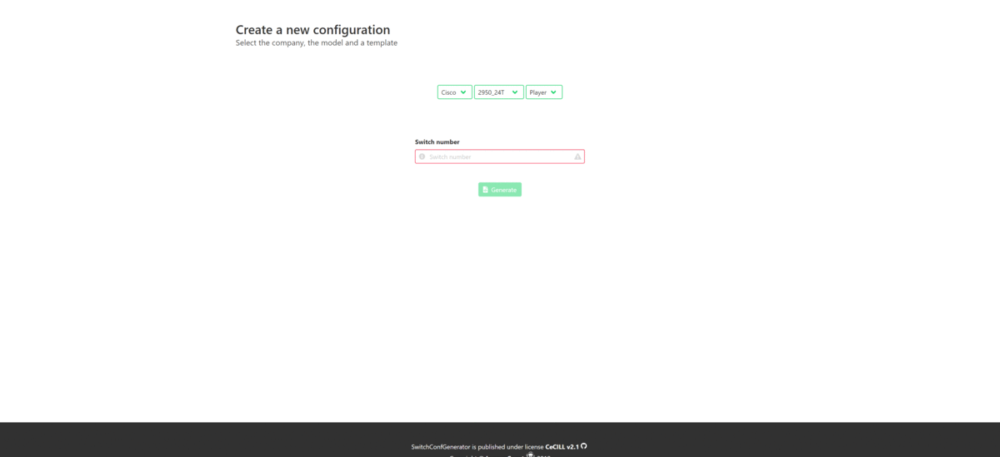

The goal of this project is to generate switch distribution (can handle differents brands/models) configuration with templates of settings

#Preview




# This tool uses :

* [Twig](https://twig.symfony.com/) - template engine
* [Bulma](https://bulma.io/) - CSS framework
* [Font Awesome](https://fontawesome.com/) - icon library

# Requirements

- PHP >= 7.0.0
- Twig >= 2.0
- SQLite3
- PDO with SQLite drivers

# Install

- Create `config/config.json` with good parameters (example : `config/config.example`)
- Open your browser and setup the database by going on `setup.php`

# Usage guide

### New configuration

- Chose the company, the model, the template and put the switch number (switch number will be the host IP and will be truncated with the hostname)
- You can change the textarea to readonly to edit mode and vice versa to edit the configuration
- You can copy/download the configuration

### Setting templates

- You can create one or more template
1. Template name : It's the template name display on New configuration page
2. SNMP :
    
    community : It's like an user id or password for SNMP
    
    right : RO (Read only) / RW (Read Write)
3. Authorization (Used for everything need a authentification SSH / Enabled configuration etc...)
    
    User : Your username
    
    Password : Your password (save in clear text)
    
    Confirmed password : Your password
4. Banner Motd : Message of the day
5. Spanning Tree : Enable or not spanning tree
6. Default gateway

    IP : IP of your default gateway
    
    Netmask : Netmask of your default gateway
7. VLAN : You can create VLAN with a network or not
    
    ID : VLAN ID
    
    Name : VLAN Name
    
    IP : Network IP of your VLAN (optionnal)
    
    Netmask : Netmask of your VLAN (optionnal)

8. Port template : You can assign your VLAN to a port template

    Distribution port : Used for every port who is not a Uplink port
    
    Uplink port : Can be set to 0-5 on First or Last ports and every ports who is on the last range (range must be > 1) will be added by default as uplink ports
        
    - example Last ports = 0 : FastEthernet0/ 0 to 48 - No default Uplink port
    - example Last ports = 0 : FastEthernet0/ 0 to 48 and GigabitEthernet0/ 1 to 2 - default Uplink port = GigabitEthernet0/ 1 to 2 
    - example Last ports = 2 : FastEthernet0/ 0 to 48 - No default Uplink port + FastEthernet0/ 47 - 48 Uplink
    - example Last ports = 2 : FastEthernet0/ 0 to 48 and GigabitEthernet0/ 1 to 2 - default Uplink port = GigabitEthernet0/ 1 to 2 + FastEthernet0/ 47 - 48 Uplink

# Dev

How add a new model ?

You have two examples at the moment : the Cisco 2950_24T and the Cisco 2960_48TT

For example we want to add the Dell 5324

#### Create directory and file

1. Create a directory with the company name `class/SwitchConfGenerator/Dell` and a subdirectory named Model `class/SwitchConfGenerator/Dell/Model`
2. Create 3 php class file `Acl`, `Crypto` and a company class file `class/SwitchConfGenerator/Dell/Dell.php`
3. Create in subdirectory Model a class file with concatenate name company_model.php `class/SwitchConfGenerator/Dell/Model/Dell_5324.php`
4. Create a directory with the company name `templates/project/Dell`
5. Create a template with concatenate name company_model.php 
(model name is the name defined in `class/SwitchConfGenerator/Dell/Model/Dell_5324.php` in `$model`) 
`templates/project/Dell/Dell_5324.twig`

#### Setup file

1. `class/SwitchConfGenerator/Dell/Acl.php` Not used at the moment (Next update)
2. `class/SwitchConfGenerator/Dell/Crypto.php`

    - Copy `class/SwitchConfGenerator/Cisco/Crypto.php` and replace `Cisco` by `Dell` on namespace and implement the encryption method used by Dell
    
3. `class/SwitchConfGenerator/Dell/Dell.php`

    - Copy `class/SwitchConfGenerator/Cisco/Cisco.php` and just replace `Cisco` by `Dell` on classname and namespace
    
4. `class/SwitchConfGenerator/Dell/Model/Dell_5324.php`

    - Copy `class/SwitchConfGenerator/Cisco/Model/Cisco_2950_24T.php` and replace `Cisco` by `Dell` on namespace, use, replace the name of the class by `Dell_5324` who must extends `Dell`.
    - `$model` is the general name model of the switch for example you have `2960-24TC`, `2960-48TC`, `2960G-8TC` etc... it must be `2960` for our case it's `5324` because there is no different model of 5324.
    - `$resumePort` is an array of ports on the switch for the 5324 it must be :
    ```php
   $resumePort = [
       [
           "first_port_id" => 1,
           "last_port_id" => 24,
           "name" => 'ethernet g'
       ]
   ];
    ```
5. `templates/project/Dell/Dell_5324.twig`
    - You have `switch` object :
        - switch.hostname (hostname)
        - switch.default_gateway.ip and switch.default_gateway.netmask (IP and Netmask)
        - switch.bannerMotd (bannerMotd)
        - switch.spanningTree (True/False)
        - switch.snmp.community and switch.snmp.permissions (Community and Permissions)
        - switch.authorization.username and switch.authorization.password (Username and Password)
        - switch.listVlan (Array of VLAN), VLAN :
            1. vlan.id
            2. vlan.name
            3. vlan.ip
            4. vlan.netmask
        - switch.port (Array of Port), Port:
            1. port.name
            2. port.untagged (id of untagged VLAN)
            3. port.tagged (Array of VLAN id)
    
#### Enable the template

1. Go on the website on `Model templates`
2. Add the company `Dell`
3. Add the model `5324`

Easy, no ? :)

Feel free to adapt template to your use case !

# Licence

The code is under CeCILL license.

You can find all details here: http://www.cecill.info/licences/Licence_CeCILL_V2.1-en.html

# Credits

Copyright © Lyon e-Sport, 2018

Contributor(s):

-Ortega Ludovic - ludovic.ortega@lyon-esport.fr

-Etienne Guilluy - etienne.guilluy@lyon-esport.fr